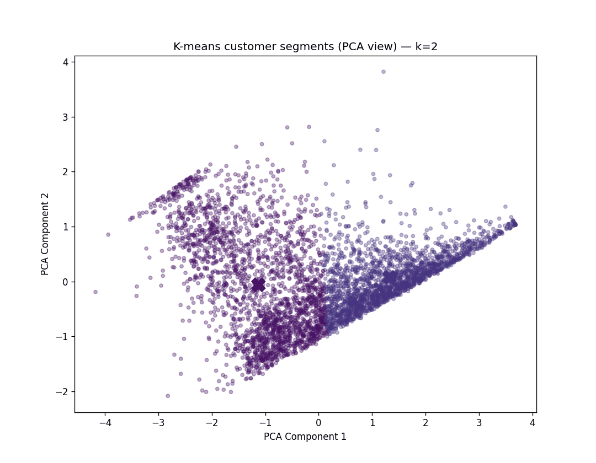

# Online retail dataset Analysis
### First repository for module 5 of DS course
 <!-- this is a comment --> 
The apprentice had used the “Online Retail Dataset” a publicly available transactional dataset from UC Irvine ML repository. It contains invoice-level purchasing records from 2010-2011 for a UK based non-store online retail business. The apprentice’s goal with this data science project is to segment the retail customers based on purchasing behaviour using unsupervised learning. K-means clustering was chosen since it allows the apprentice to showcase feature engineering (MacQueen, 1967) by creating Recency, Frequency and Monetary features which can be used to segment out clusters.
#### K- means GIF
 

